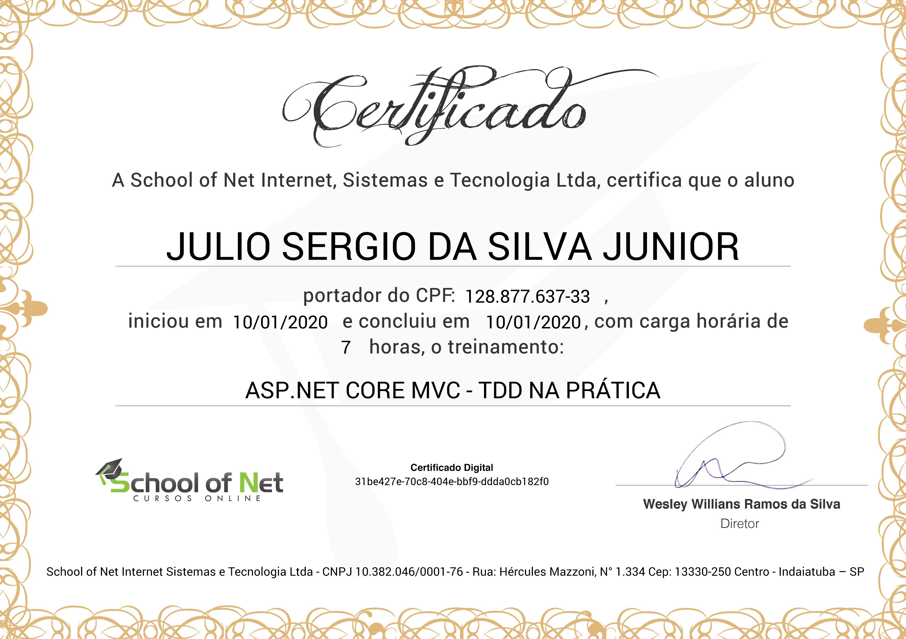

# ASP.NET Core MVC - TDD na Prática
## [School of Net](https://www.schoolofnet.com)

* ASP.NET Core MVC
* TDD

Instrutor: Anybal Rocha
"O curso tem o objetivo de apresentar e estimular o aluno a desenvolver códigos a partir da implementação de testes no ASP.NET Core MVC. O TDD é uma técnica utilizada para guiar o desenvolvimento com base nos testes. Você cria o teste para uma função que ainda não foi desenvolvida e após o teste, você desenvolve seu código, propriamente dito. Ao final do seu desenvolvimento você terá um sistema com 100% (ou muito próximo disso) de cobertura de testes, o que garante maior qualidade na sua entrega."

